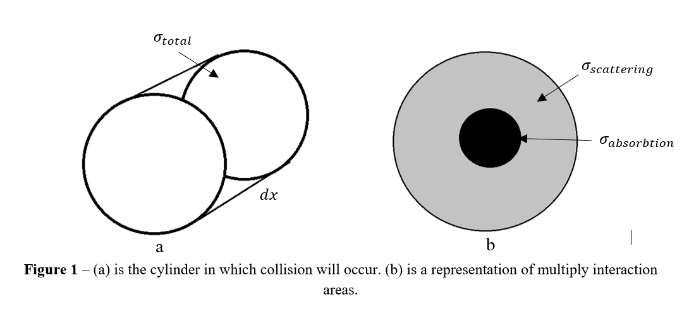

# Simulation of the Penetration of thermal Neutrons through material

## Abstract
In this report, Monte Carlo methods were investigated and then used to build a simulation of thermal neutrons moving through different types of shielding via recording the particle’s history. The simulation was then used to calculate the characteristic attenuation of water, lead and graphite and found to be λ_c= 1.950±0.001,9.34±0.01 and 11.22±0.02. However, the model used to obtain them could not describe all the behaviour in the survivability of neutrons throughout the material. Further complexity in the simulation was built by using multiply materials; this demonstrated the power and versatility of the method.

## 1. Introduction
The modern Monte Carlo method was first developed by Stanislaw Ulam when working on the Manhattan project to solve neutron diffusion in fissionable material. All the factors were known and understood, but the problem was too complex to solve by analytical methods. The name “Monte Carlo” was suggested as a code name by one of the team members after a casino in Monaco [1]. 
A similar technique was used in 18th century by Georges-Louis Leclerc and Comte de Buffon to estimate π, by scattering needless along an evenly striped floor and working out the probability that the needles stand between the strips [2]. This method is extremely powerful across a wide arrangement of problems and is used frequency in modern-day physics, so it is vital to understand the basics.

## 2. Theory of Neutron scattering
This report will look at estimating the penetration of neutrons through different types of shielding by simulating the random motion of each neutron through the material. When a neutron enters the shielding, it can fly through or collide with an atom and so will travel an average distance through the material before it collides. The average number of particles in a given volume, n, is,

###   (1)

where ρ is the mass density, M_A is the atomic mass and N_A=6.02214076×10^23 Avogadro constant. Now assume that each atom has some cross-section in which a collision will occur, σ, and that the nucleus of the material is much greater than a neutron, σ≫σ_n. The probability of no collision occurring in some distance x+dx, is,

### 

where P(x) is the probability of no collision occurring in a distance of x and P((dx) ̅) is the probability of a collision in distance dx. If the neutron is travelling through dx a collision will occur if a nucleus and neutron occupy the same cylinder shown in fig.1a. Therefore, P((dx) ̅ )=nσdx, making eq.2 become,

###  (2)

Taylor expanding P(x+dx) around x, ignoring O(〖dx〗^2 ) terms, and cancelling the P(x) and dx gives,

###  (3)

which can be solved and normalized, removing the constant of integration, forming,

###  (4)

where λ=1/nσ and λ is the mean free path [4]. The area σ has no physical or geometric significance due to the collisions being purely quantum mechanical interactions, so σ is determined experimentally. It is also noted that σ is not a constant and will depend on many factors such as the energy of the neutron and the temperature of the shielding [5]. This report will only look at thermal neutrons; neutrons that have similar energy to the internal energy of the material. There are also fast neutrons, which have much higher energy than the material they move into and are important to consider in more complex systems.

### 

Once a collision occurs many different processes can occur such as fission, elastic scattering, inelastic scattering, absorption and even more; each of these interactions has a corresponding area [5]. This report will keep things simple and only look at elastic scattering and absorption, therefore the total collision area is,

###  (5)

There is some probability that one process occurs when colliding, for example, absorption occurring if the collision is more direct. This can be thought of that concentric circles of areas each corresponding to a different process, as shown in fig.1b, so the probability that one process occurs is,

###  (6)

If scattering occurs the neutron, it will be assumed they will travel off in a uniformly random direction, which is a safe assumption to make with thermal neutrons. So, it now becomes clear that even from all these assumptions calculating the characteristic length a neutron will travel is a complex problem.

## 3. Simulation approach

The basis of this simulation is to take a statistical approach, so a way of producing random numbers is required. Linear-congruential generators have been historically used, which operate by using the simple sequence, 

###  (7)

where x is a sequence of pseudo-random numbers and A, C and M are parameters chosen to produce a random sequence [1]. In this report, a permuted congruential generator will be used instead with its implementation in the NumPy library. This generator uses serval transformations with eq.7, including multiply bit sizes, to make the results more statistically random and maintain the speed of an LCG [6]. 

Now using this generator function random distances can be selected by the probability function in eq.4, simply by calculating the cumulative distribution function and inverting it, giving,

###  (8)

where x is the random distance and u is a random number between 0 and 1. As shown in fig.2.

### fig.2

Random numbers are also required for picking the scattering direction, the generation of random unit vectors are shown in fig.3a. To avoid clustering at poles, arccos⁡(v), was used to evenly generate angles, in the same way as in eq.7. Then combining these generators shows were neutrons travel after a scatter in fig.3b. It is clear from these figures that all our random numbers generate uniform distributions in the required bounds.

### fig.3

Each neutron is interdependent of each other, so they can be simulated separately and the result of what happens to each neutron can be stored. A random walk of a neutron is shown in fig.4a. This is called a particle history and can be used to determine if the neutron is absorbed, reflected or transmitted. Many simulations of neutrons can be completed in a second, summing what happens to calculate average transmission through a material. This is more clearly shown in fig.4b where the bounds of the material are seen.

### fig.4

The average length a neutron will travel through a material is called the characteristic attenuation length, a simple model of this would be to extend the collision model in eq.4. So, scattering in this model is equivalent to free movement. Therefore, making there some length a neutron will travel before being absorbed by the material. This makes the characteristic length λ_c, the average length a neutron will travel through a material. The characteristic length of a material was then found by varying the thickness of the material and collected the transmission coefficients; generating the probability the neutron travels so far at each point. However, it’s expected that this model won’t be perfect as it doesn’t account for the random scattering on the neutrons. 

For simulating more than more material a new method is required to jump between materials. This was done using fictitious steps, which are used when moving into a new material. It works by selecting the smallest λ_t from each material passed through and then repeating this jump in the same direction, until the neutron lands in the new material. It was then tested by simulating two of the same materials with a total length of 10cm and its results compared to the earlier simulation of 10cm of water. The results were the same, a similar test was repeated for 3 materials with the same validation. More complex modelling can be built up from this basis, for example in fig.5 is water and graphite shielding, which is a common use of moderators in a reactor.

### fig.5

## 4. Results

The first experiment was to find the transmission coefficients through 10cm of water, lead and graphite. Errors were calculated by conducting the simulation 20 times and calculating the mean and variance of all these simulations. The transmission, absorption and reflection coefficients were calculated for water, lead and graphite, with data from table.1. The results are shown in table.2.

## fig.6

Graphite had the highest transmission coefficient and lowest absorption coefficient, which isn’t surprising since it has the smallest σ_t and smallest σ_a. So, neutrons were unlikely to collide and even less likely to be absorbed. Lead has similar properties but higher σ_a, account for its higher absorption coefficient. Water has a very low transmission coefficient, which is expected due to its large σ_t, making water the most effective moderator at preventing neutron transmission.

## fig.7

Next, the characteristic attenuation length was determined, simulating different many different thicknesses, starting with water to assess how well our simplistic model fits. The results should not be the same as λ_t=1/(nσ_t ), as successive scattering should make the characteristic length longer, but they should be in a similar order of magnitude as λ_t=0.289,2.66,2.52 cm for water, lead and graphite respectively. 
A range of 0 to 5cm was chosen as transmission coefficient becomes too close to zero past 10cm to produce significant results as zeroes must be removed as ln0 is undefined. This is due to the low number of neutrons passing through the material and making data less statistically significant, while more data is collected at the lower thicknesses, overfitting the models. The model doesn’t seem to fit in fig.6a and this becomes even more clear in fig.6b where the natural logarithm was taken, showing a more quadratic relationship.

### fig.8

A quadratic fit was used to obtain a better fit of fig.6b and the results are shown in fig.7, therefore using the model,

###  (9)

where a is a correction factor and c is a normalization constant. This complexity comes from further collisions after the neutron first scatters, it essentially starts to diffuse randomly through the solid. Making this model the first few terms in a diffusion equation that envelopes the decay, but the exploration of this idea is beyond this report [8]. This model gives λ= 0.992±0.004 and a= 0.0811±0.001, however characteristic length becomes highly complex to calculate. Since λ≫a the simplistic model will be used at a larger range. 

### fig.9

### fig.10

Using the model of eq.4 the characteristic lengths are shown in table.3 and fig.8. A range of 1 to 20cm was chosen to minimise the effect of overfitting to small thicknesses, however, this was more effective for water than lead and graphite, due to water’s relatively low λ_c. Lead and graphite seem to have even more no-linear behaviour, which is further indicated with their high χ^2; due to more diffusion happening further into the materials, forming larger waves. Water is the best at diminishing the motion of neutrons at all thicknesses tested.

### fig.11

The final simulation of two layers of water surrounding a graphite moderator gave transmission, reflection and absorption coefficient of 0.093±0.01, 0.921±0.021 and 0.070±0.002, calculated from 10 simulations with 10,000 neutrons. Demonstrating the versatility and usefulness of this technique because any desired transmission coefficient can not be tested.

## 5. Conclusions

Uniform random numbers were successfully generated and implemented into the simulation using the Monte Carlo method to walk neutrons through materials. From this report’s simulations, graphite was the best at allowing neutrons to pass and water was the worst, making water the best shielding from neutrons. The characteristic attenuation length for water, lead and graphite was found, λ_c= 1.950±0.001,9.34±0.01 and 11.22±0.02. However, a more sophisticated model, considering diffusion, should have been used as the relationship wasn’t fully described by eq.4. The complexity of the simulation was extended to include three materials setting a clear baseline on how this method could be used more interesting simulations.

## References

[1] https://permalink.lanl.gov/object/tr?what=info:lanl-repo/lareport/LA-UR-88-9068
[2] https://books.google.co.uk/books?id=GOAEAAAAQAAJ&pg=PA43%7CHistoire&redir_esc=y#v=onepage&q&f=false
[3] https://www.bipm.org/utils/common/pdf/si-brochure/SI-Brochure-9-EN.pdf
[4] http://www.hep.man.ac.uk/u/rmj/PHYS10471/lecture11_summary.pdf
[5] The physics of the Manhattan project
[6] https://www.cs.hmc.edu/tr/hmc-cs-2014-0905.pdf
[7] https://online.manchester.ac.uk/bbcswebdav/pid-7486523-dt-content-rid-36067143_1/courses/I3133-PHYS-20762-1191-2SE-011068/PHYS20762%20Lecture%209.pdf
[8] Mathematics for physicists
